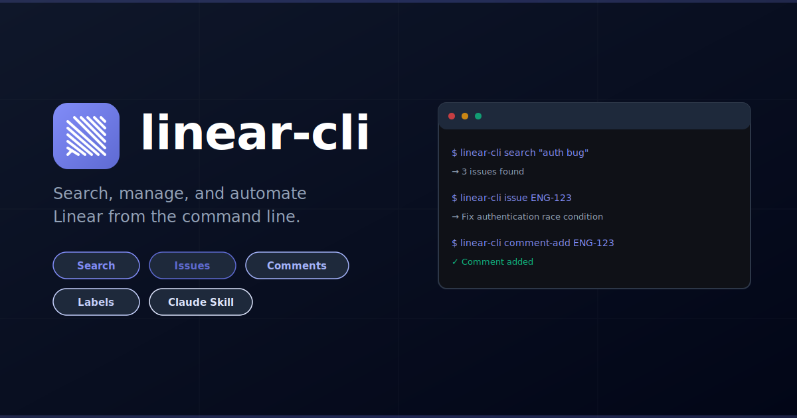

# linear — CLI for the Linear API



[](https://github.com/dotbrains/linear-cli/actions/workflows/ci.yml)
[](https://github.com/dotbrains/linear-cli/packages)
[](https://polyformproject.org/licenses/shield/1.0.0/)


Search issues, manage comments, list labels and users, and check platform status — all from the command line. All commands output JSON.

## Quick Start

```sh
# Install (see Installation section for registry setup)
npm install -g @dotbrains/linear-cli

# Set up your API key
linear init

# Search for issues
linear search "auth bug"

# Get a specific issue with comments
linear issue ENG-123

# List issues by label
linear issues --labels Bug

# Add a comment
linear comment-add ENG-123 -b "Looks good to me"

# Check Linear platform status
linear status
```

## How It Works

1. Reads your API key from `~/.config/linear/config.json`.
2. Uses the official `@linear/sdk` to communicate with the Linear GraphQL API.
3. Paginates automatically — all list commands fetch every page.
4. Outputs raw JSON to stdout for easy piping into `jq`, scripts, or other tools.

## Installation

This package is published to [GitHub Packages](https://github.com/dotbrains/linear-cli/packages), not npmjs. One-time setup is required:

```sh
# 1. Point the @dotbrains scope at GitHub Packages
npm config set @dotbrains:registry https://npm.pkg.github.com

# 2. Authenticate with a GitHub personal access token (needs read:packages scope)
npm config set //npm.pkg.github.com/:_authToken <YOUR_GITHUB_PAT>
```

> **Tip:** If you have the [GitHub CLI](https://cli.github.com/) installed, you can use `gh auth token` instead of a PAT:
> ```sh
> npm config set //npm.pkg.github.com/:_authToken $(gh auth token)
> ```

Then install globally:

```sh
npm install -g @dotbrains/linear-cli
```

Or install from source:

```sh
git clone https://github.com/dotbrains/linear-cli.git
cd linear-cli
npm install
npm link
```

## Commands

| Command | Description |
|---|---|
| `linear init` | Set up linear by configuring your API key |
| `linear me` | Show the authenticated user's profile |
| `linear search <term>` | Full-text search (Issues, Documents, or Projects) |
| `linear users` | List organization users |
| `linear teams` | List all teams |
| `linear team <id>` | Fetch a single team by ID |
| `linear labels` | List all issue labels |
| `linear workflow-states` | List workflow states (optionally filter by `--team <id>`) |
| `linear issues` | List issues with optional filters (`--labels`, `--team`, `--assignee`, `--state`, `--priority`) |
| `linear issue <id>` | Fetch a single issue by ID or identifier (e.g. ENG-123) |
| `linear issue-create` | Create a new issue (`--team` and `--title` required) |
| `linear issue-update <id>` | Update an existing issue |
| `linear issue-delete <id>` | Delete an issue |
| `linear comment-add <issueId> -b <body>` | Add a comment to an issue |
| `linear comment-edit <commentId> -b <body>` | Edit an existing comment |
| `linear comment-delete <commentId>` | Delete a comment |
| `linear comment-get <commentId>` | Get a comment by UUID |
| `linear comments-mine` | List comments by the authenticated user |
| `linear projects` | List projects (optionally filter by `--team <id>`) |
| `linear project <id>` | Fetch a single project by ID |
| `linear cycles` | List cycles (optionally filter by `--team <id>`) |
| `linear cycle <id>` | Fetch a single cycle by ID |
| `linear roadmaps` | List all roadmaps |
| `linear roadmap <id>` | Fetch a single roadmap by ID |
| `linear notifications` | List notifications for the authenticated user |
| `linear notification-mark-read <id>` | Mark a notification as read |
| `linear notification-mark-unread <id>` | Mark a notification as unread |
| `linear notifications-mark-read-all` | Mark all notifications as read |
| `linear notifications-mark-unread-all` | Mark all notifications as unread |
| `linear notifications-archive-all` | Archive all notifications |
| `linear issue-archive <id>` | Archive an issue |
| `linear issue-unarchive <id>` | Unarchive an issue |
| `linear issue-relations <issueId>` | List relations for an issue |
| `linear issue-relation <id>` | Fetch a single issue relation by ID |
| `linear issue-relation-add` | Add a relation between two issues (`--issue`, `--related-issue`, `--type`) |
| `linear issue-relation-delete <id>` | Delete an issue relation |
| `linear comment-resolve <commentId>` | Resolve a comment |
| `linear comment-unresolve <commentId>` | Unresolve a comment |
| `linear user <id>` | Fetch a single user by ID |
| `linear documents` | List documents |
| `linear document <id>` | Fetch a single document by ID |
| `linear document-create` | Create a document (`--title`, `--project` required) |
| `linear document-update <id>` | Update a document |
| `linear document-delete <id>` | Delete a document |
| `linear attachments <issueId>` | List attachments for an issue |
| `linear attachment <id>` | Fetch a single attachment by ID |
| `linear attachment-link-url <issueId>` | Link an external URL to an issue (`--url` required) |
| `linear attachment-link-github-pr <issueId>` | Link a GitHub PR to an issue (`--url` required) |
| `linear attachment-link-github-issue <issueId>` | Link a GitHub Issue to a Linear issue (`--url` required) |
| `linear attachment-delete <id>` | Delete an attachment |
| `linear status` | Check Linear platform status |

## Configuration

```sh
# First-time setup
linear init
```

This prompts for your API key, validates it against the Linear API, and writes the config to `~/.config/linear/config.json`.

Generate a personal API key at [Linear > Settings > Security](https://linear.app/settings/account/security).

To reconfigure, run `linear init --force`.

## Agent Skill

This repo includes an agent skill at `.claude/skills/linear/SKILL.md` that is automatically discovered by [Warp](https://www.warp.dev/) and [Claude Code](https://docs.anthropic.com/en/docs/claude-code). When working in this repo, the agent can use `linear` whenever you ask about bugs, issues, or anything Linear-related.

With the skill active, you can say things like:

> Find every engineering-related bug in Linear that is unfinished. For each one, look at the problem and then — by analyzing the codebase and git history — figure out which engineers are best suited to addressing each issue. Then leave a comment with that info.

The agent will use `linear` to search for issues, inspect the codebase, and post comments — all autonomously.

## Specification

See [`SPEC.md`](./SPEC.md) for the full technical specification — every command, its options, step-by-step behavior, authentication flow, pagination strategy, and error handling.

## Testing

This project does not include unit tests. Each command is a thin wrapper around [`@linear/sdk`](https://www.npmjs.com/package/@linear/sdk) — the CLI parses arguments, calls the SDK, and prints the response as JSON. There is no business logic to test independently; the SDK itself is tested and maintained by Linear. Correctness is verified by running commands against the live API during development.

## Dependencies

- **[Node.js](https://nodejs.org/)** >= 18
- **[@linear/sdk](https://www.npmjs.com/package/@linear/sdk)** — official Linear API client
- **[Commander](https://www.npmjs.com/package/commander)** — CLI framework

## License

This project is licensed under the [PolyForm Shield License 1.0.0](https://polyformproject.org/licenses/shield/1.0.0/) — see [LICENSE](LICENSE) for details.