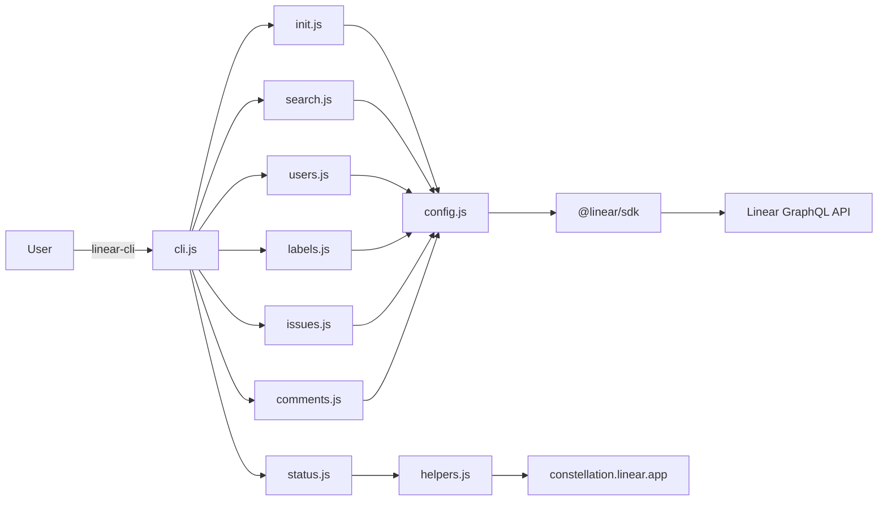
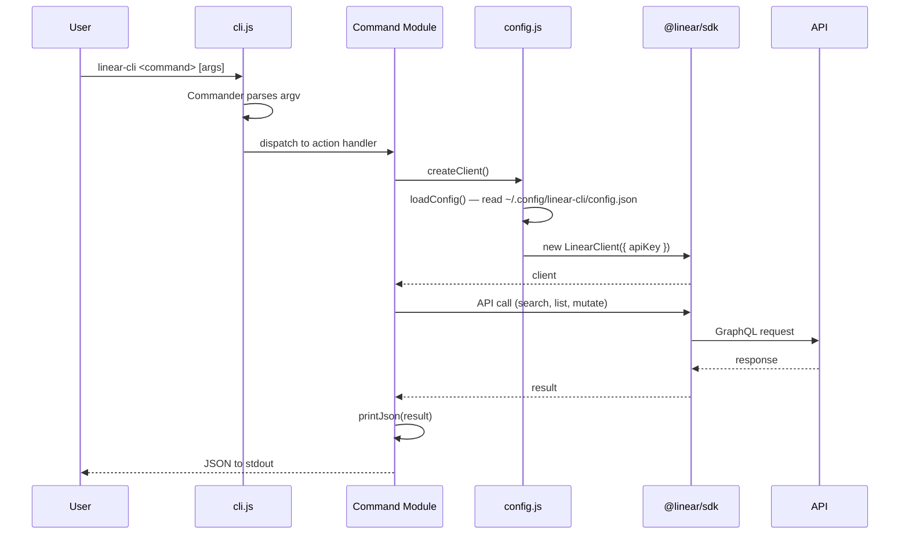

# linear-cli — CLI for the Linear API


[](https://github.com/dotbrains/linear-cli/actions/workflows/ci.yml)
[](https://github.com/dotbrains/linear-cli/packages)
[](https://opensource.org/licenses/MIT)


A CLI for searching issues, managing comments, listing labels and users, and checking platform status via the Linear GraphQL API. All commands output JSON. Built on [`@linear/sdk`](https://www.npmjs.com/package/@linear/sdk) and [Commander](https://www.npmjs.com/package/commander).

## Problem

Linear has a rich GraphQL API but no official CLI. When working in the terminal — triaging bugs, scripting issue workflows, or integrating with CI — you need a fast way to query and mutate Linear data without switching to the browser.

`linear-cli` provides:

- **Full-text search** — search issues, documents, or projects from the command line.
- **Automatic pagination** — all list commands fetch every page, so you always get the full result set.
- **JSON output** — every command writes JSON to stdout, making it trivial to pipe into `jq`, scripts, or other tools.
- **Comment management** — add, edit, delete, and list comments without leaving the terminal.
- **Agent integration** — ships with a Warp/Claude Code agent skill so AI agents can query Linear autonomously.

## Configuration

### Config File

| Variable | Location | Description |
|---|---|---|
| `apiKey` | `~/.config/linear-cli/config.json` | Linear personal API key (`lin_api_...`) |

The config file is created by `linear-cli init`. Generate a personal API key at [Linear > Settings > Security](https://linear.app/settings/account/security).

### Config Format

```json
{
  "apiKey": "lin_api_..."
}
```

## Commands

### `linear-cli init [--force]`

Set up linear-cli by configuring your API key.

Steps:
1. Checks if `~/.config/linear-cli/config.json` already exists (exits unless `--force` is passed).
2. Prompts for an API key via stdin.
3. Validates the key by calling `client.viewer` against the Linear API.
4. Creates the config directory (`~/.config/linear-cli/`) if it doesn't exist.
5. Writes the config file with the validated key.

### `linear-cli search <term>`

Full-text search across Linear entities.

Options:
- `-t, --type <type>` — entity type: `Issue` (default), `Document`, or `Project`.
- `--archived` — include archived results.

Steps:
1. Reads the API key from config.
2. Calls `client.searchIssues()`, `client.searchDocuments()`, or `client.searchProjects()` based on `--type`.
3. Prints the result nodes as JSON.

### `linear-cli users`

List all organization users.

Steps:
1. Reads the API key from config.
2. Fetches users with `client.users()`, page size 100.
3. Follows pagination (`fetchNext()`) until all users are collected.
4. Prints all users as JSON.

### `linear-cli labels`

List all issue labels.

Steps:
1. Reads the API key from config.
2. Fetches labels with `client.issueLabels()`, page size 250.
3. Follows pagination until all labels are collected.
4. Prints all labels as JSON.

### `linear-cli issues --labels <names...>`

List issues matching one or more labels.

Options:
- `-l, --labels <names...>` — one or more label names (required, space-separated, case-sensitive).
- `--first <n>` — page size (default: 50).

Steps:
1. Reads the API key from config.
2. Queries `client.issues()` with a filter: `{ labels: { name: { in: opts.labels } } }`.
3. Follows pagination until all matching issues are collected.
4. Prints all issues as JSON.

When multiple labels are given, issues matching **any** of them are returned (OR semantics).

### `linear-cli issue <id>`

Fetch a single issue by UUID or identifier (e.g. `ENG-123`).

Steps:
1. Reads the API key from config.
2. Attempts `client.issue(id)` (direct UUID lookup).
3. If that fails, falls back to `client.searchIssues(id, { first: 1, includeArchived: true })` to resolve identifiers like `ENG-123`.
4. Fetches all comments on the issue via `issue.comments()` with pagination.
5. Prints the issue with its comments as JSON.

### `linear-cli comment-add <issueId> -b <body>`

Add a comment to an issue.

Steps:
1. Reads the API key from config.
2. Calls `client.createComment({ issueId, body })`.
3. Prints the created comment as JSON.

The issue can be specified by UUID or identifier. The body is markdown.

### `linear-cli comment-edit <commentId> -b <body>`

Edit an existing comment by its UUID.

Steps:
1. Reads the API key from config.
2. Calls `client.updateComment(commentId, { body })`.
3. Prints the updated comment as JSON.

### `linear-cli comment-delete <commentId>`

Delete a comment by its UUID.

Steps:
1. Reads the API key from config.
2. Calls `client.deleteComment(commentId)`.
3. Prints `{ "success": true/false }` as JSON.

### `linear-cli comment-get <commentId>`

Get a comment by its UUID.

Steps:
1. Reads the API key from config.
2. Calls `client.comment({ id: commentId })`.
3. Prints the comment as JSON.

### `linear-cli comments-mine`

List comments created by the authenticated user.

Options:
- `--first <n>` — page size (default: 50).

Steps:
1. Reads the API key from config.
2. Resolves the authenticated user via `client.viewer`.
3. Queries `client.comments()` with a filter: `{ user: { id: { eq: me.id } } }`.
4. Follows pagination until all comments are collected.
5. Prints all comments as JSON.

### `linear-cli status`

Check Linear platform status.

Steps:
1. Makes an HTTPS GET request to `https://constellation.linear.app/api/statuspage`.
2. Parses the JSON response.
3. Prints it as JSON.

This command does not require an API key.

## How It Works

### Authentication

The CLI reads a personal API key from `~/.config/linear-cli/config.json`. The key is loaded once per process and cached in memory. A `LinearClient` instance from `@linear/sdk` is created on demand for each command.

If the config file is missing, the CLI prints an error directing the user to run `linear-cli init`. If the file exists but contains a legacy `cookie` field instead of `apiKey`, a migration message is shown.

### Pagination

All list commands (`users`, `labels`, `issues`, `comments-mine`) follow the same pattern:

1. Make an initial query with a `first` (page size) parameter.
2. Push the result `nodes` into an accumulator array.
3. While `connection.pageInfo.hasNextPage` is true, call `connection.fetchNext()` and push the new nodes.
4. Print the full array when done.

This guarantees the caller always receives the complete result set regardless of how many pages exist.

### JSON Output

Every command calls `printJson()`, which is `JSON.stringify(data, null, 2)` to stdout. All user-facing messages (errors, prompts, progress) go to stderr, keeping stdout clean for piping.

### Status Check

The `status` command bypasses the Linear SDK entirely. It makes a raw HTTPS GET request to Linear's status page API (`constellation.linear.app`) using Node's built-in `https` module, avoiding the need for an API key.

## Architecture



### Command Registration Pipeline



## Package Structure

```
linear-cli/
├── src/
│   ├── cli.js                 # CLI entry point: Commander setup, command registration
│   ├── config.js              # Config loading (CONFIG_PATH), LinearClient factory (createClient)
│   ├── helpers.js             # httpGet(), printJson(), STATUS_HOST constant
│   └── commands/
│       ├── init.js            # `init` command — API key setup and validation
│       ├── search.js          # `search` command — full-text search (Issue, Document, Project)
│       ├── users.js           # `users` command — list organization users
│       ├── labels.js          # `labels` command — list issue labels
│       ├── issues.js          # `issues` + `issue` commands — list by label, fetch single with comments
│       ├── comments.js        # `comment-add`, `comment-edit`, `comment-delete`, `comment-get`, `comments-mine`
│       └── status.js          # `status` command — Linear platform status check
├── assets/
│   └── og-image.svg           # Project banner image
├── .claude/
│   └── skills/
│       └── linear/
│           └── SKILL.md       # Agent skill for Warp / Claude Code integration
├── .github/workflows/
│   ├── ci.yml                 # CI: lint + build (matrix: Node 18/20, ubuntu/macos)
│   └── publish.yml            # Publish to GitHub Packages on release
├── eslint.config.js           # ESLint flat config (CommonJS, ES2022)
├── package.json               # Dependencies, scripts, bin entry
├── SPEC.md                    # This file
├── README.md                  # User-facing documentation
└── LICENSE                    # MIT
```

## Testing Strategy

### Linting

ESLint with the flat config (`eslint.config.js`) runs on all files in `src/`. Configured for CommonJS (`sourceType: "commonjs"`) with `ecmaVersion: 2022`. The only custom rule is `no-unused-vars` with `argsIgnorePattern: "^_"`.

### Build Verification

The build step uses esbuild to bundle `src/cli.js` into a single `dist/linear-cli` file targeting Node 18. This runs as part of CI to catch import errors and missing dependencies.

### Running Checks

```bash
# Lint
npm run lint

# Build
npm run build
```

### CI

Linting and build verification run on every push to `main`/`master` and all pull requests. See [GitHub Actions](#github-actions) for details.

## GitHub Actions

### CI — `.github/workflows/ci.yml`

Triggered on push to `main`/`master`, all pull requests, and via `workflow_call` (reusable).

**Jobs:**

1. **lint**
   - Runs on `ubuntu-latest`, Node 20.
   - Steps: checkout → setup Node → `npm ci` → `npm run lint`.

2. **build**
   - Matrix: `node: [18, 20]`, `os: [ubuntu-latest, macos-latest]`.
   - Steps: checkout → setup Node → `npm ci` → `npm run build`.

### Publish — `.github/workflows/publish.yml`

Triggered when a GitHub release is published.

**Steps:**
1. Runs CI via `workflow_call` (reusable workflow).
2. Checks out the repo.
3. Sets up Node 20 with the GitHub Packages registry (`https://npm.pkg.github.com`).
4. Runs `npm ci`, `npm run build`, `npm publish`.
5. Publishes `@dotbrains/linear-cli` to GitHub Packages using the built-in `GITHUB_TOKEN`.

Consumers install by configuring the `@dotbrains` scope:

```sh
# .npmrc
@dotbrains:registry=https://npm.pkg.github.com
```

```sh
npm install -g @dotbrains/linear-cli
```

## Implementation Language

**JavaScript** (CommonJS). Published as `@dotbrains/linear-cli` on [GitHub Packages](https://github.com/dotbrains/linear-cli/packages). Distributed as a single bundled file via `dist/linear-cli` (esbuild, targeting Node 18). The `bin` field in `package.json` points to `dist/linear-cli`.

Key dependencies:
- **[`@linear/sdk@^78.0.0`](https://www.npmjs.com/package/@linear/sdk)** — official Linear GraphQL API client. Handles authentication, query building, pagination cursors, and type-safe responses.
- **[`commander@^14.0.3`](https://www.npmjs.com/package/commander)** — CLI framework. Parses arguments, registers subcommands, generates help text.

Dev dependencies:
- **[`esbuild@^0.27.4`](https://esbuild.github.io/)** — bundler. Produces the single-file `dist/linear-cli` executable.
- **[`eslint@^10.0.3`](https://eslint.org/)** + **`@eslint/js@^10.0.1`** — linter with flat config.

## Design Decisions

### 1. JSON-only output, messages to stderr

All command output is JSON on stdout. All human-readable messages (errors, prompts, validation feedback) go to stderr. This makes the CLI composable: you can pipe output directly into `jq` or another program without worrying about non-JSON noise.

### 2. `@linear/sdk` instead of raw GraphQL

The official SDK provides typed methods, built-in pagination helpers (`fetchNext()`), and handles authentication. Using it avoids hand-writing GraphQL queries and managing cursor-based pagination manually. The tradeoff is a heavier dependency, but the SDK is well-maintained and eliminates an entire class of bugs.

### 3. Identifier fallback via search

`linear-cli issue ENG-123` first tries a direct UUID lookup. If that throws (because `ENG-123` is an identifier, not a UUID), it falls back to `searchIssues` with `first: 1`. This gives users the ergonomics of typing identifiers (what they see in the UI) without requiring a separate "resolve identifier" API call.

### 4. No SDK for status check

The `status` command hits `constellation.linear.app`, which is a separate service from the Linear API. Using Node's built-in `https` module avoids initializing the SDK (and requiring an API key) for a command that doesn't need authentication.

### 5. Single-file esbuild bundle

The CLI is bundled into one file with esbuild rather than distributed as raw source. This simplifies the npm package (`files: ["dist"]`), avoids runtime dependency resolution issues, and makes global installs (`npm install -g`) fast and reliable.

### 6. Config file over environment variables

The API key lives in `~/.config/linear-cli/config.json` rather than an environment variable. This keeps the key out of shell history and environment listings, and the `init` command validates the key before persisting it. The config path follows the XDG Base Directory convention on macOS/Linux.

### 7. Eager pagination

All list commands fetch every page before printing. This is simpler than streaming and guarantees the output is a single valid JSON array. For the expected data volumes (org users, labels, filtered issues), full pagination completes quickly. If a user needs partial results, they can pipe through `jq '.[0:10]'`.

## Non-Goals

- **Issue creation / mutation.** The CLI is read-heavy by design. Issue creation involves many fields (team, assignee, priority, etc.) that are better handled in the Linear UI or via scripts using the SDK directly.
- **Interactive TUI.** The CLI outputs JSON for composability. No curses-based UI, no interactive prompts beyond `init`.
- **Webhook handling.** No server component. The CLI is a client that talks to Linear's API on demand.
- **Multi-workspace.** One API key, one workspace. Switching workspaces requires re-running `init --force`.
- **Offline support.** Every command makes a live API call. No local caching or offline mode.
- **TypeScript.** The project uses plain JavaScript (CommonJS) intentionally to keep the toolchain minimal — no compilation step for development, just esbuild for the release bundle.
